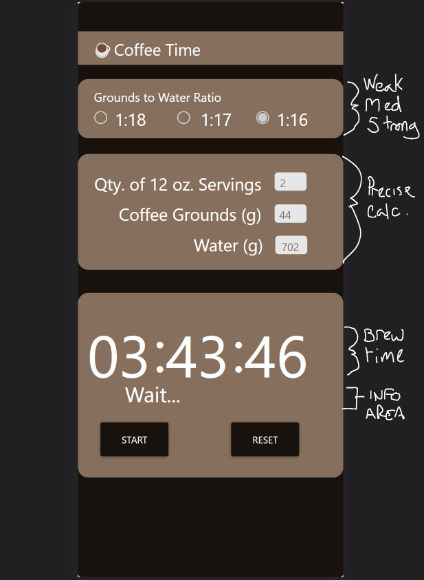

# ***Coffee Time***

---------------------------------
---------------------------------

## Mobile Application

This app helps calculate the proper ratios of water to grounds, the proper ammounts of each for a specific number of cups, and the weight and timing targets for each pour in a three-stage pourover. The app includes sound cues and alerts to avoid missing any steps as the timer runs.

---------------------------------

## Tools Used

Microsoft Visual Studio

- React Native
- Expo

---------------------------------

## Getting Started

Clone this repository to your local machine.

```
git clone https://github.com/Micha-L-Davis/coffee-time.git
```

Once downloaded, you can either use the dotnet CLI utilities or Visual Studio 2017 (or greater) to build the web application.

```
cd coffee-time
`npm i`
```

Install all dependencies needed for the project.

```
cd YourRepo/YourProject
expo start
```

---------------------------------

## Usage



1. Enter desired strength of coffee: weak (1:18) to strong (1:16)
2. Enter the quantity of twelve-ounce servings.
3. Enter the weight in grams of coffee grounds.
4. Water will calculate automatically.
5. Press start, and follow prompts to pour the appropriate weight of water at the appropriate interval.
6. Enjoy!

---------------------------


## Author

Micha Davis

------------------------------
